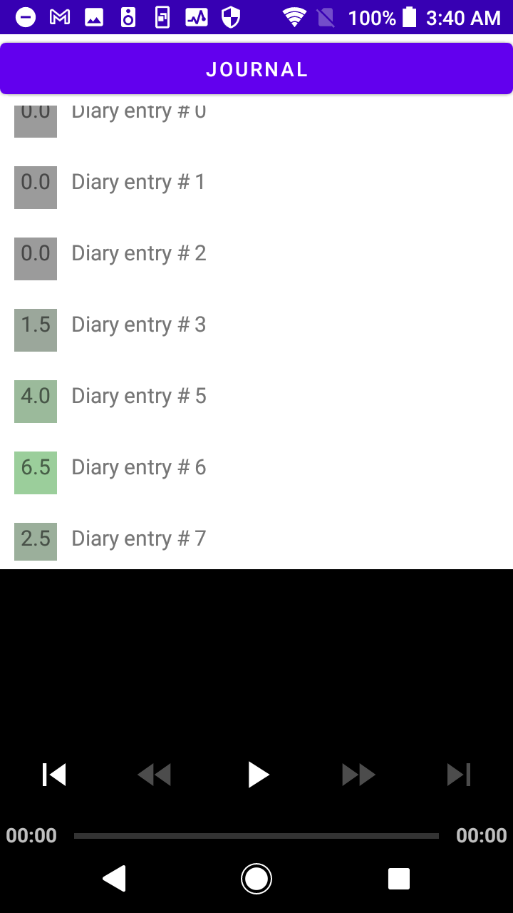
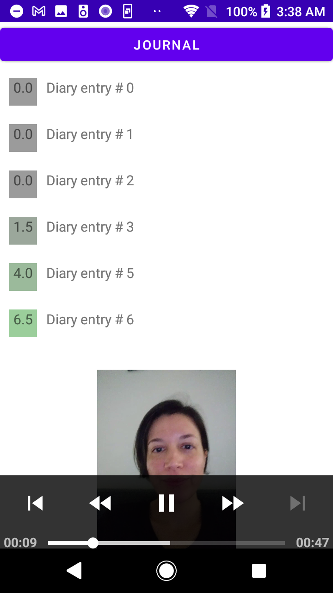
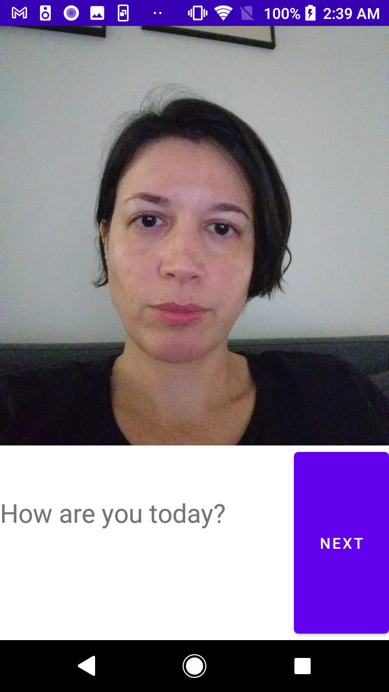
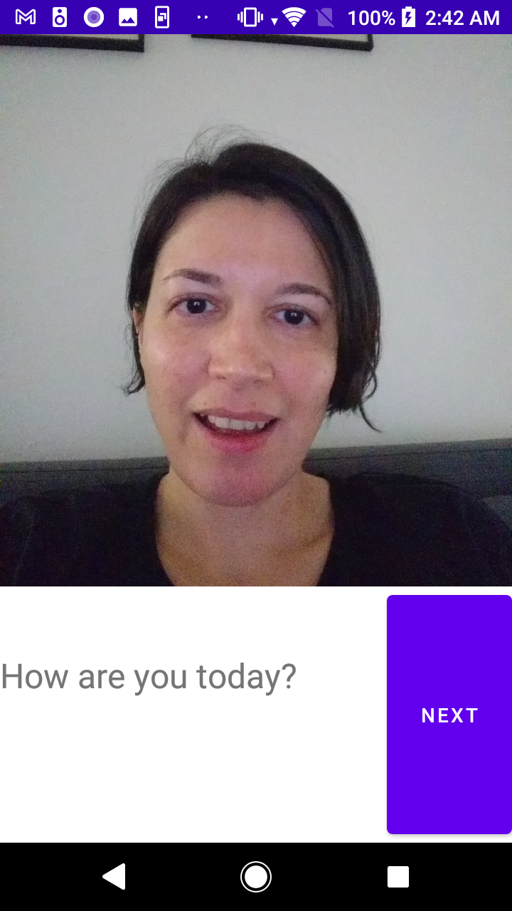

# Reflections prototype (Android app)

Reflections is a virtual diary for recording your daily thoughts and
sentiments. Every day Reflections asks you a number of questions,
that will make you reflect on your mental well-being and how you can
improve it. The diary is recorded as a video.

While recording your diary entries, Reflections will measure your
sentiments using facial expression analysis. And, while not in 
the current prototype, also semantic sentiment and voice analysis. 
This way, Reflections will provide you a timeline of how your mood has
changed during the year.

You can go back to days that were especially encouraging or
challenging, to reflect, remember, and reconsider what made you feel that
way.

# The current prototype

The current prototype was written during the Junction
2020-hackathon. None of the team had any previous Android development
experience.

Check out our Junction 2020 pitch: 

## App Screenshots and Interaction Flow

The landing screen is the **Journal** screen, which lists current diary entries. The squares corresponding to each of the items represent the extracted facial sentiment analysis (represented by a score and color intensity):

The user can then click on any of the diary entries, and the corresponding video will start playing:

At any time, the user can **start a new Journal entry** by clicking on the top menu. Then the voice interaction will start and the user is guided through a number of questions to help reflect on their well-being. The number and content of the questions can be customized. All questions are spoken out loud in order to favor an easy voice interaction for the journaling:

 

After all the questions have been answered, the video recording is stored along with the extracted facial sentiment analysis. The score for the facial emotion is based on the expressed emotions during the journal recording. For example, note the difference in facial expression between the two entries below. This additional information can complement the diary entry with some automatically generated objective data. 

 

